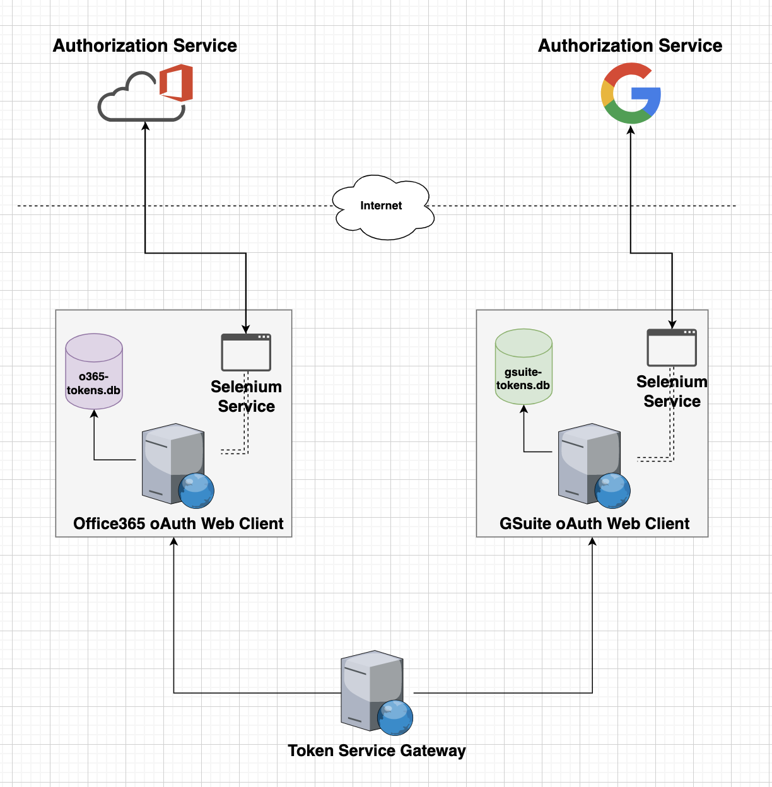

# TokenService

---
```text
This repository contains a saas that renew tokens for mailboxes in the cloud (at the moment supporting Office365 Outlook) 
```

### Overview 
TokenService goal is to refresh oauth2 token access to an account of the Microsoft Office 365 Suite .

The service will attempt to refresh a token and then store it in a database for future usage.

The service store authorization tokens which then can be used for future purpose using a GET request 

---

### HOW TO:

1. give permission to the startservice script
```shell    
$ chmod 777 ./start_service.sh
```
2. edit the port to your relevant port
```shell
$ cat ./token_service_main.py | sed s/port=41197/port=..../g  
```
3. edit to your matching table name in your db
```shell
$ cat ./dao.py | sed s/__tablename__ = "token_user_records"/__tablename__ = "...."/g
```
4. update your template properties with your relevant values

---
### NOTE: 
```text
If you want to bind a local database to the service , 
the `database` key inside `properties.yml` should not 
have any `key:value` pairs under it. 

otherwise, 
keep the default template and update it values. 
```

<b>Example:</b>
```yaml
security:
  office365: "YOUR_O365_SAAS_GENERIC_PASS"
  gsuite: "YOUR_GSUITE_SAAS_GENERIC_PASS"
domains:
  office365: "onmicrosoft.com"
  gsuite: "avanan.net"
oauth2:
  gsuite:
    web:
      client_id: "YOUR_CLIENT_ID"
      project_id: "YOUR_PROJECT_NAME"
      auth_uri: "https://accounts.google.com/o/oauth2/auth"
      token_uri: "https://oauth2.googleapis.com/token"
      auth_provider_x509_cert_url: "https://www.googleapis.com/oauth2/v1/certs"
      client_secret: "YOUR_CLIENT_SECRET"
      redirect_uris:
        - "YOUR_REDIREC_URL"
    app_scopes:
      - "https://mail.google.com/"
      - "https://www.googleapis.com/auth/drive"
  office365:
    redirect_uri: "http://localhost:41197/"
    app_sec: "YOUR_ADD_SEC"
    app_id: "YOUR_APP_ID"
    token_url: "https://login.microsoftonline.com//oauth2/v2.0/token"
    authorize_url: "https://login.microsoftonline.com/common/oauth2/v2.0/authorize"
    app_scopes: "offline_access Chat.ReadWrite Files.ReadWrite.All Mail.ReadWrite Mail.Send User.Read Sites.Manage.All"

database:


```


--- 
### Flow
